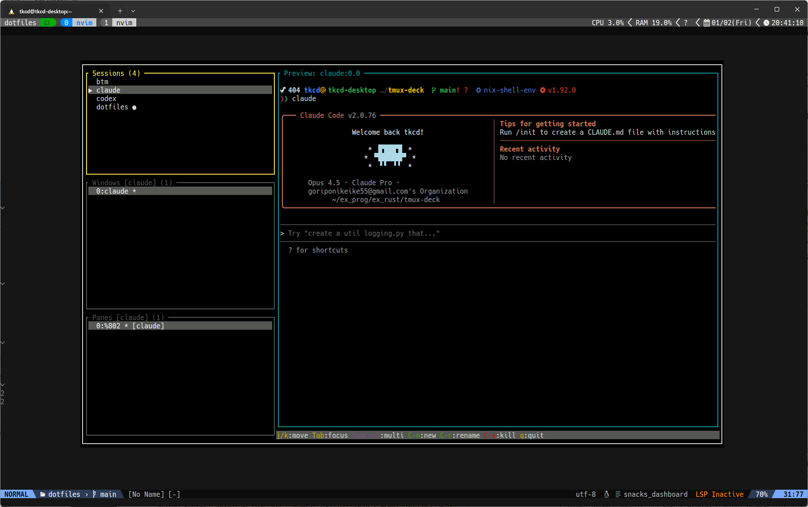
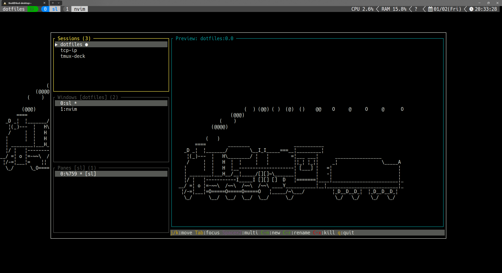

# Tmux Deck
tmux-deck is a tmux session manager. 
Monitoring multi session Realtime preview.


# Features
- 🗂️ Tmux Session Management(New, Rename, Kill)
- 📄 Easy management Windows and Panes between Sessions
- 👀 Realtime Preview
- ⚙️ Easy Configure

# Quick Start

```bash
tmux-deck
```




## Using in tmux popup
Add following key-bind in your `.tmux.conf`, `tmux-deck` would start up on tmux popup.

```bash
bind SPACE run-shell "tmux popup -w80% -h80% -E tmux-deck"
```



# Installation
## `cargo`
```
cargo install tmux-deck     # build from source
cargo binstall tmux-deck    # prebuild-binary
```

## `nix run`
You can try `tmux-deck` easily following.
```
nix run github:takeshid/tmux-deck
```

Also you can config it like following in your `.tmux.conf`.
```bash
bind SPACE run-shell "tmux popup -w80% -h80% -E nix run github:takeshid/tmux-deck"
```

## `flake.nix`
if youde use flake, you can add `tmux-deck` in your flake.nix

```nix
{
  inputs = {
    tmux-deck.url = "github:takeshid/tmux-deck";
  };
  outputs = {
    devShells = nixpkgs.lib.mkShell {
        packages = [
        ]
        ++ tmux-deck.packages.x86_64-linux
    };
  };
}
```

# Comparison with Similar Project

`tmux-deck` takes a different approach compared to other tmux session managers.

| Feature                     | tmux-deck            | tmuxinator         | tmuxp                   |
| ---------                   | -----------          | ------------       | -------                 |
| **Language**                | Rust                 | Ruby               | Python                  |
| **Interface**               | TUI (Interactive)    | CLI                | CLI                     |
| **Realtime Preview**        | ✅                   | ❌                 | ❌                      |
| **Multi-session Preview**   | ✅                   | ❌                 | ❌                      |
| **Runtime Dependencies**    | None (single binary) | Ruby runtime       | Python runtime          |
| **Configuration Format**    | TOML                 | YAML               | YAML/JSON               |
| **Session Definition**      | Interactive          | Declarative (YAML) | Declarative (YAML/JSON) |
| **Save/Restore Sessions**   | Planned              | ✅                 | ✅                      |
| **Freeze Existing Session** | -                    | ✅                 | ✅                      |

## Why tmux-deck?

### 🔴 Realtime Preview
The most distinctive feature of tmux-deck. Preview the actual content of all your tmux sessions in real-time. No more blindly switching between sessions.

### 🚀 Zero Configuration
Start using immediately without writing any configuration files. Just run `tmux-deck` and manage your sessions visually.

### 📦 Single Binary
No runtime dependencies. No Ruby, no Python, no gem/pip packages. Just download and run.

### 🎯 Interactive TUI
Visual tree structure of sessions, windows, and panes. Navigate with keyboard shortcuts and see changes instantly.

### ⚡ Fast & Lightweight
Written in Rust for maximum performance and minimal resource usage.


## When to use others?

- **tmuxinator/tmuxp**: When you need declarative session definitions that can be version-controlled and shared across teams. Ideal for reproducible development environments.
- **tmux-deck**: When you need real-time visibility into multiple sessions and prefer interactive management over configuration files.

# Status
- [x] Session Management(New, Rename, Kill)
    - [x] Realtime Preview
    - [ ] Search and Filtering(fuzzy find)
    - [ ] Saving and Restoring sessions
    - [ ] Sort
        - [ ] Most Recently Used
        - [ ] Alphabet
        - [ ] Pinning
- [x] Multi Preview
    - [ ] Injection command to pane
    - [ ] Zoom preview
    - [ ] Pinning
- [ ] Configure
    - [ ] Keybinding
    - [ ] Layout
    - [ ] Color Theme
- Misc
    - [ ] LLM Integration
    - [ ] Installation for nix

# License
MIT License.
See [LICENSE](LICENSE).
