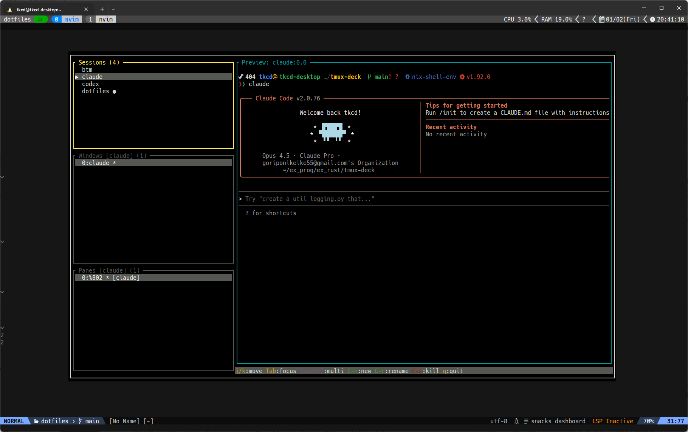
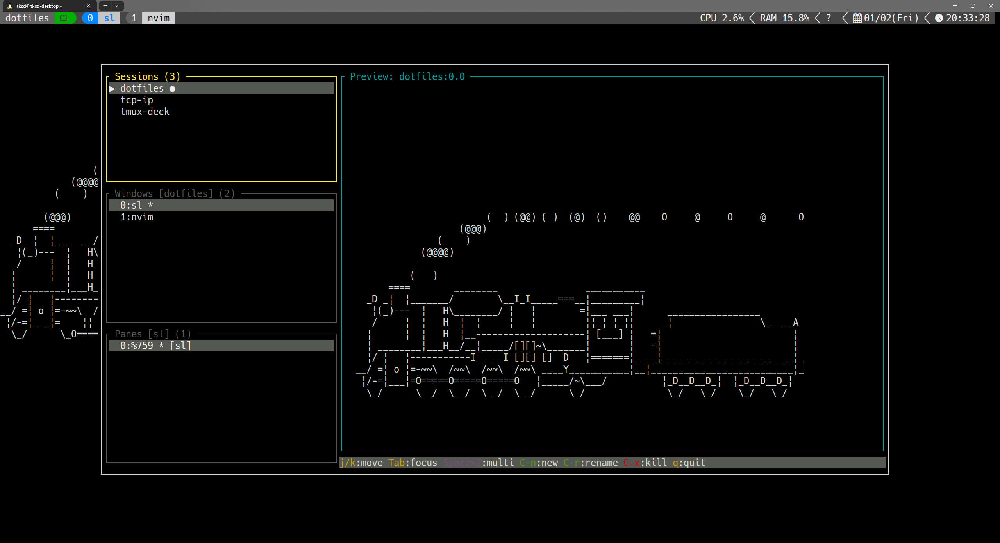

# Tmux Deck
tmux-deck is a tmux session manager. 
Monitoring multi session Realtime preview.


# Features
- 🗂️ Tmux Session Management(New, Rename, Kill)
- 📄 Easy management Windows and Panes between Sessions
- 👀 Realtime Preview
- 🤖 Claude Code status markers (working / waiting / done) driven by hooks
- 🛰️ Claude fleet dashboard (`d`): every Claude pane sorted by attention, jump with `Enter`
- ⚙️ Easy Configure

# Quick Start

```bash
tmux-deck
```




## Using in tmux popup
Add following key-bind in your `.tmux.conf`, `tmux-deck` would start up on tmux popup.

```bash
bind SPACE run-shell "tmux popup -w80% -h80% -E tmux-deck"
```



# Installation
## `cargo`
```
cargo install tmux-deck     # build from source
cargo binstall tmux-deck    # prebuild-binary
```

## `nix run`
You can try `tmux-deck` easily following.
```
nix run github:takeshid/tmux-deck
```

Also you can config it like following in your `.tmux.conf`.
```bash
bind SPACE run-shell "tmux popup -w80% -h80% -E nix run github:takeshid/tmux-deck"
```

## `flake.nix`
if youde use flake, you can add `tmux-deck` in your flake.nix

```nix
{
  inputs = {
    tmux-deck.url = "github:takeshid/tmux-deck";
  };
  outputs = {
    devShells = nixpkgs.lib.mkShell {
        packages = [
        ]
        ++ tmux-deck.packages.x86_64-linux
    };
  };
}
```

# Configuration

tmux-deck is **zero-config**: it runs with sensible defaults and needs no file.
To customise it, drop a TOML file at:

```
$XDG_CONFIG_HOME/tmux-deck/config.toml   # usually ~/.config/tmux-deck/config.toml
```

(or point at one with `tmux-deck --config <path>`). A missing or malformed file
just falls back to the defaults, so it can never stop the app from starting. A
fully-commented template lives at [`docs/config.example.toml`](docs/config.example.toml).

```toml
[preview]
interval = 300            # preview refresh interval (ms); --interval overrides this

[theme]
preset = "default"        # see the table below
[theme.colors]            # optional per-role overrides on top of the preset
# accent = "#7dcfff"

[keybindings]             # remap the main actions (chords like `za` are fixed)
quit           = ["q", "Esc"]
new_session    = "C-n"

[hooks.claude]            # per-state markers: glyph + hex colour ("spinner" animates)
working = { glyph = "spinner", color = "#ff8700" }
waiting = { glyph = "◆", color = "#ff8700" }

[layout]
session_panel_width = 30  # left panel width (%); tree_split / multi_selected_ratio too

[behavior]
default_view   = "tree"   # "tree" | "multi"
exit_on_switch = true     # exit after switching to a session
```

## Themes

Set `theme.preset` to one of:

| Preset       | Notes                                                         |
| ------       | -----                                                         |
| `default`    | The original palette (orange markers, cyan/yellow accents).   |
| `monochrome` | Distinguished by brightness, not hue — colour-blind friendly. |
| `dracula`    |                                                               |
| `nord`       |                                                               |
| `gruvbox`    |                                                               |
| `tokyonight` |                                                               |
| `catppuccin` | Mocha flavour.                                                |
| `solarized`  | Dark variant.                                                 |
| `cyberdream` |                                                               |
| `carbonfox`  |                                                               |

Theme colour values are a name (`red`, `darkgray`, `lightblue`…), a 256-colour
index (`"208"`), or truecolor hex (`"#rrggbb"`). **Marker colours under
`[hooks.*]` are hex codes only** (e.g. `color = "#ff8700"`).

## Key bindings

The status bar at the bottom of the deck always reflects your current bindings,
so remapping (e.g. `kill_session = "C-d"`) updates the on-screen hint too.

The remappable actions and their defaults:

| Action    | Default    | Action           | Default |
| ------    | -------    | ------           | ------- |
| `quit`    | `q`, `Esc` | `new_session`    | `C-n`   |
| `refresh` | `r`        | `rename_session` | `C-r`   |
| `sort`    | `s`        | `kill_session`   | `C-x`   |
| `group`   | `g`        | `enter`          | `Enter` |
| `input`   | `i`        | `dashboard`      | `d`     |

A binding is one key string or a list. Modifiers are joined with `-` (`C`/`Ctrl`,
`S`/`Shift`, `A`/`M`/`Alt`); keys are a single character or a name (`Esc`, `Tab`,
`Up`, `Space`, …). Navigation (`j/k/h/l`, arrows, Tab) and the `za` fold /
double-`Space` chords are fixed for now.

# Claude Code Integration

tmux-deck highlights tmux entities that are running [Claude Code](https://code.claude.com).
By default it detects the `claude` process and shows a `●`. If you also install
the Claude **hooks**, the marker reflects what Claude is *doing* in each pane.
States are distinguished by the marker **shape** (the colour is always the
same), so they stay legible on any terminal palette:

| Marker            | State   | Meaning                                             |
| ------            | -----   | -------                                             |
| `⠋⠙⠹…` (animated) | Working | A prompt was submitted / a tool is running          |
| `◆`               | Waiting | Claude is waiting on you (permission / idle prompt) |
| `✓`               | Done    | Claude finished its turn                            |
| `✗`               | Error   | The turn ended with an error                        |
| `●`               | Running | Claude process detected, no hook state yet          |

Windows and sessions roll up to the most attention-worthy state of their
children (waiting > error > working > done).

## Setup

Install the hooks into Claude Code's user settings (`~/.claude/settings.json`):

```bash
tmux-deck hook install
```

Use `--project` to write to the project-local `.claude/settings.json` instead.
The command is idempotent and preserves any existing settings.

### How it works

`hook install` registers `tmux-deck hook report` for the `UserPromptSubmit`,
`PreToolUse`, `PostToolUse`, `Notification`, `Stop`, `SubagentStop` and
`SessionEnd` events. On each event Claude runs the reporter, which records the
calling pane's state (keyed by `$TMUX_PANE`) under
`$XDG_STATE_HOME/tmux-deck/claude/`. The TUI reads those files on each refresh
and updates the markers. Stale files are cleaned up automatically, and nothing
is shown for panes that never ran Claude — so the integration is entirely
opt-in.

# Comparison with Similar Project

`tmux-deck` takes a different approach compared to other tmux session managers.

| Feature                     | tmux-deck            | tmuxinator         | tmuxp                   |
| ---------                   | -----------          | ------------       | -------                 |
| **Language**                | Rust                 | Ruby               | Python                  |
| **Interface**               | TUI (Interactive)    | CLI                | CLI                     |
| **Realtime Preview**        | ✅                   | ❌                 | ❌                      |
| **Multi-session Preview**   | ✅                   | ❌                 | ❌                      |
| **Runtime Dependencies**    | None (single binary) | Ruby runtime       | Python runtime          |
| **Configuration Format**    | TOML                 | YAML               | YAML/JSON               |
| **Session Definition**      | Interactive          | Declarative (YAML) | Declarative (YAML/JSON) |
| **Save/Restore Sessions**   | Planned              | ✅                 | ✅                      |
| **Freeze Existing Session** | -                    | ✅                 | ✅                      |

## Why tmux-deck?

### 🔴 Realtime Preview
The most distinctive feature of tmux-deck. Preview the actual content of all your tmux sessions in real-time. No more blindly switching between sessions.

### 🚀 Zero Configuration
Start using immediately without writing any configuration files. Just run `tmux-deck` and manage your sessions visually.

### 📦 Single Binary
No runtime dependencies. No Ruby, no Python, no gem/pip packages. Just download and run.

### 🎯 Interactive TUI
Visual tree structure of sessions, windows, and panes. Navigate with keyboard shortcuts and see changes instantly.

### ⚡ Fast & Lightweight
Written in Rust for maximum performance and minimal resource usage.


## When to use others?

- **tmuxinator/tmuxp**: When you need declarative session definitions that can be version-controlled and shared across teams. Ideal for reproducible development environments.
- **tmux-deck**: When you need real-time visibility into multiple sessions and prefer interactive management over configuration files.

# Status
- [x] Session Management(New, Rename, Kill)
    - [x] Realtime Preview
    - [ ] Search and Filtering(fuzzy find)
    - [ ] Saving and Restoring sessions
    - [ ] Sort
        - [x] Most Recently Used
        - [x] Alphabet
        - [ ] Pinning
- [x] Multi Preview
    - [x] Injection command to pane
    - [x] Zoom preview
    - [ ] Pinning
- [x] Configure (TOML, XDG `~/.config/tmux-deck/config.toml`)
    - [x] Keybinding
    - [x] Layout
    - [x] Color Theme
- Misc
    - [x] LLM Integration
        - [x] Claude Code status markers via hooks
    - [x] Installation for nix

# License
MIT License.
See [LICENSE](LICENSE).
