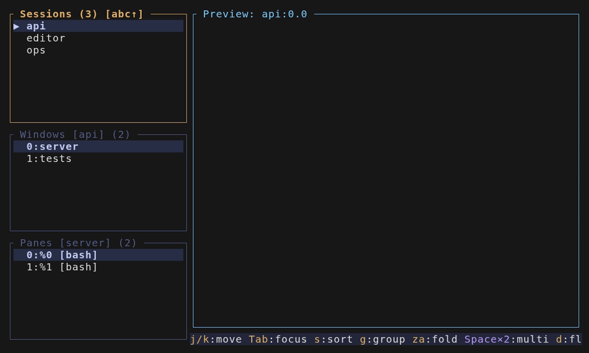
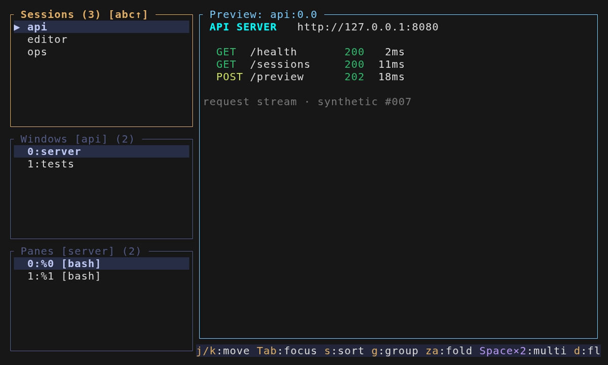
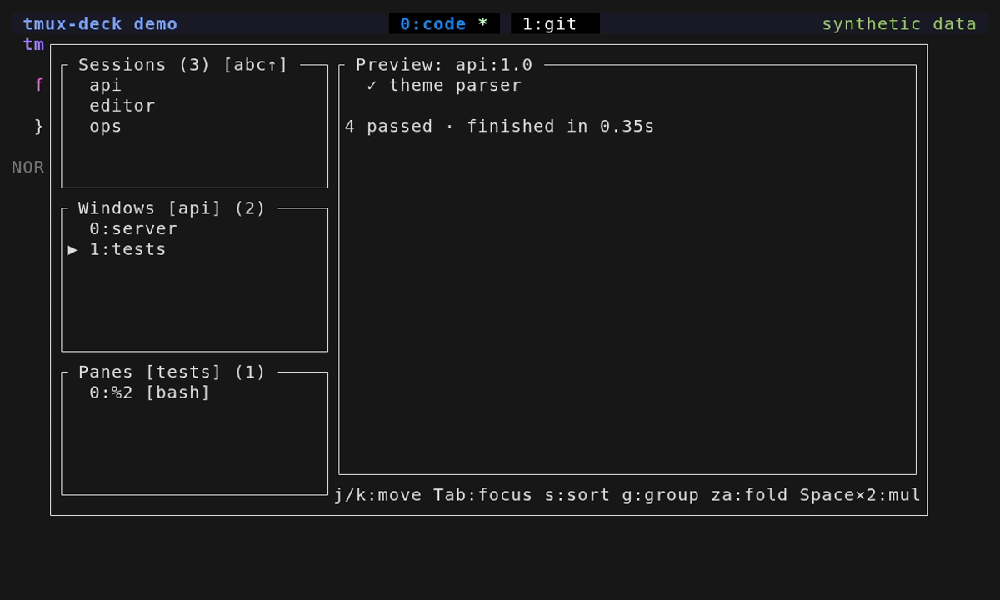

# tmux-deck

[](https://crates.io/crates/tmux-deck)
[](LICENSE)

See every tmux session before you switch.

`tmux-deck` is an interactive session manager with live pane previews. Browse
sessions, windows, and panes in one keyboard-driven view, or open a dashboard
that monitors several sessions at once.



## Why tmux-deck?

- **Live previews** — inspect the current contents of a pane without switching
  away from your work.
- **Multi-session view** — monitor windows across several sessions on one
  screen.
- **Interactive management** — create, rename, group, sort, and kill sessions
  from the TUI.
- **Zero configuration** — sensible defaults work immediately; themes, layout,
  refresh rate, and key bindings remain configurable.
- **Optional coding-agent awareness** — show working, waiting, done, and error
  markers for Claude Code and Codex panes, plus a Claude background-agent view.

`tmux-deck` is distributed as a Rust binary and requires a working `tmux`
installation.

## Install

### Cargo

```bash
cargo install tmux-deck
tmux-deck
```

### Nix

Try the latest revision without installing it:

```bash
nix run github:takeshiD/tmux-deck
```

## Use it as a tmux popup

Add this binding to `~/.tmux.conf`, then press `prefix + Space`:

```tmux
bind-key Space display-popup -w 80% -h 80% -E tmux-deck
```

If you prefer the Nix command:

```tmux
bind-key Space display-popup -w 80% -h 80% -E \
  'nix run github:takeshiD/tmux-deck'
```

| Full session manager | tmux popup |
| --- | --- |
|  |  |

## Essential keys

The status bar always reflects your configured bindings.

| Key | Action | Key | Action |
| --- | --- | --- | --- |
| `j` / `k` or arrows | Move | `Tab` / `Shift+Tab` | Change panel |
| `Enter` | Switch to selection | `m` | Toggle Sessions/Agent Monitor |
| `s` | Cycle sort order | `g` | Assign a session group |
| `za` | Fold/unfold a group | `i` | Send input to a pane |
| `Ctrl+n` | New session | `Ctrl+r` | Rename session |
| `Ctrl+x` | Kill session | `q` / `Esc` | Quit |
| `d` | Toggle Background Agents | `r` | Refresh |
| `Ctrl+d` / `Ctrl+u` | Scroll preview half-page down/up | `Ctrl+j` / `Ctrl+k` | Scroll preview one line down/up |

Preview scrolling applies to TreeView. Moving to another pane returns its
preview to the live tail; all four bindings can be changed in the configuration.

## Configuration

Configuration is optional. Put a TOML file at:

```text
$XDG_CONFIG_HOME/tmux-deck/config.toml
```

This is usually `~/.config/tmux-deck/config.toml`. You can also pass a file
with `tmux-deck --config <path>`. A missing or malformed file falls back to the
defaults.

```toml
[preview]
interval = 300

[theme]
preset = "tokyonight"

[layout]
session_panel_width = 30
tree_split = [30, 35, 35]

[agent_monitor]
completed_retention_secs = 600

[behavior]
default_view = "tree"       # "tree" or "agent_monitor" (legacy "multi" works)
default_sort = "recent"     # "recent", "recent_asc", "abc", "abc_asc"
exit_on_switch = true

[keybindings]
quit = ["q", "Esc"]
new_session = "C-n"
agent_monitor = "m"
preview_half_page_down = "C-d"
preview_half_page_up = "C-u"
preview_line_down = "C-j"
preview_line_up = "C-k"
```

See the fully commented [configuration reference](docs/config.example.toml)
for every setting and semantic colour role.

### Themes

The built-in presets are `default`, `monochrome`, `dracula`, `nord`,
`gruvbox`, `tokyonight`, `catppuccin`, `solarized`, `cyberdream`, and
`carbonfox`. Individual semantic colours can be overridden with named colours,
256-colour indexes, or `#rrggbb` values.

## Advanced: coding-agent integration

tmux-deck can identify panes running Claude Code or
[Codex](https://learn.chatgpt.com/docs/hooks) and display a `●` marker.
Installing the optional lifecycle hooks makes the marker reflect the pane's
current state. Claude markers are orange by default; Codex markers are blue.
When both are present on one node, the Claude marker is shown first.

| Marker | State | Meaning |
| --- | --- | --- |
| `⠋⠙⠹…` | Working | A prompt or tool is running |
| `◆` | Waiting | The agent is waiting for input or permission |
| `✓` | Done | The turn completed |
| `✗` | Error | The turn ended with an error |
| `●` | Running | An agent is detected without hook state |

Install either integration in your user settings:

```bash
tmux-deck hook install          # ~/.claude/settings.json
tmux-deck hook install --codex  # ~/.codex/hooks.json
```

Add `--project` for project-local settings (`.claude/settings.json` or
`.codex/hooks.json`). The installer is idempotent and preserves existing
hooks. User-global installs respect `CLAUDE_CONFIG_DIR` and `CODEX_HOME` when
set. Codex requires newly installed hooks to be reviewed and trusted with
`/hooks` before first use.

### Agent Monitor

Press `m` to monitor every tmux pane running Claude Code or Codex. `Tab`
switches between an attention-first queue and a stable overview. The overview
adapts between live cards, a selected live preview with summarized peers, and
a virtual summary list based on the terminal size and agent count.

| Key | Action |
| --- | --- |
| `Tab` | Switch Attention/Overview (persisted) |
| `h` / `j` / `k` / `l` or arrows | Move between agent panes |
| `PageUp` / `PageDown`, `Home` / `End` | Navigate the summary list |
| `Enter` | Switch to the selected tmux pane |
| `f` | Toggle a focused live preview |
| `/` | Filter by text, `state:`, `agent:`, or `repo:` |
| `m` / `Esc` | Return to Sessions |

Completed turns remain visible for ten minutes by default. Agents detected
without lifecycle hooks still appear as `RUN` with state unavailable.

### Background Agents

Press `d` to open a full-screen view of Claude Code background sessions. It
reads the sessions managed by `claude agents` and groups them by working
directory.

| Key | Action |
| --- | --- |
| `j` / `k` | Select an agent session |
| `Enter` | Attach with `claude attach` |
| `p` | Toggle the preview panel |
| `v` | Toggle transcript/screen preview |
| `s` | Generate an execution summary |
| `d` | Return to Sessions |

Background Agents needs a Claude Code version that provides background
sessions. Pane markers, Agent Monitor, and Background Agents degrade
independently when their optional metadata is unavailable.

## How it differs

tmux-deck focuses on interactively inspecting and managing sessions that are
running now. Tools such as tmuxinator and tmuxp focus on declaratively defining,
sharing, and restoring session layouts. Use tmux-deck for live visibility; use
a declarative manager when reproducible session setup is the primary goal.

## Development

Run the Rust checks:

```bash
cargo test --all --locked
cargo clippy --all-targets --all-features --locked -- -D warnings
```

Regenerate the README demo and screenshots:

```bash
nix run .#demo
```

The demo command starts an isolated tmux server with synthetic sessions. It
does not read from or modify your current tmux server. The VHS tapes and fixture
live in [`demo/`](demo/).

Contributor documentation will be maintained separately from this user-facing
README.

## License

[MIT](LICENSE)
